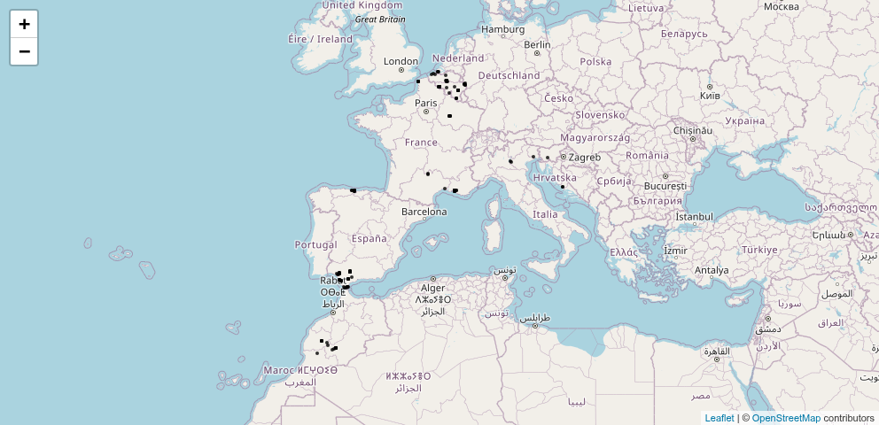

<!-- README.md is generated from README.Rmd. Please edit that file -->

# cochr

<!-- badges: start -->

<!-- badges: end -->

Get an interactive map from your personnal data from eBird.

## Installation

You can install the development version of cochr from GitHub with:

``` r
# install.packages("pak")
pak::pak("vieuxtypes/cochr")
```

## Download your eBird data

Before using `bird_map()`, you need to download your observations from
eBird:

1.  Go to [eBird](https://ebird.org/myebird)
2.  Click on **Download My Data**.
3.  Click on **Request My Observations**.
4.  Wait for the email from eBird.
5.  Download the attached `MyEBirdData.csv` file.
6.  Use this file with `bird_map()`.

## Get a map of your life list

``` r
library(cochr)
bird_map("data/MyEBirdData.csv")
```


